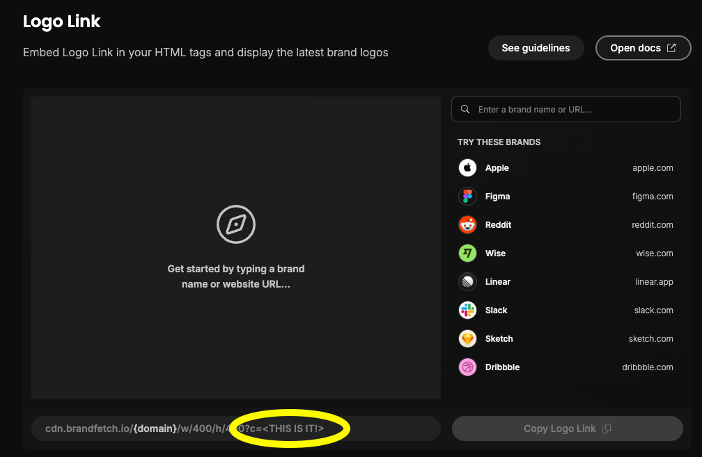

# Account, Merchant and Security Logos

Sure has integration with the [Brand Fetch Logo Link](https://brandfetch.com/developers/logo-api) service to provide logos for accounts, merchants and securities.
Logos are currently matched in the following ways:

- For accounts, Plaid integration for the account is required and matched via FQDN (fully qualified domain name) from the Plaid integration
- For merchants, OpenAI integration is required and automatically matched to the merchant name and matched via FQDN
- For securities, logos are matched using the ticker symbol

> [!NOTE]
> Currently ticker symbol matching cannot specify the exchange and since US exchanges are prioritized, securities from other exchanges might not have the right logo.

## Enabling Brand Fetch Integration

A Brand Fetch Client ID is required and to obtain a client ID, sign up for an account [here](https://brandfetch.com/developers/logo-api).

Once you enter the Client ID into the Sure settings under the `Self-Hosting` section, logos from Brand Fetch integration will be enabled.
Alternatively, you can provide the client id using the `BRAND_FETCH_CLIENT_ID` environment variable to the web and worker services.

